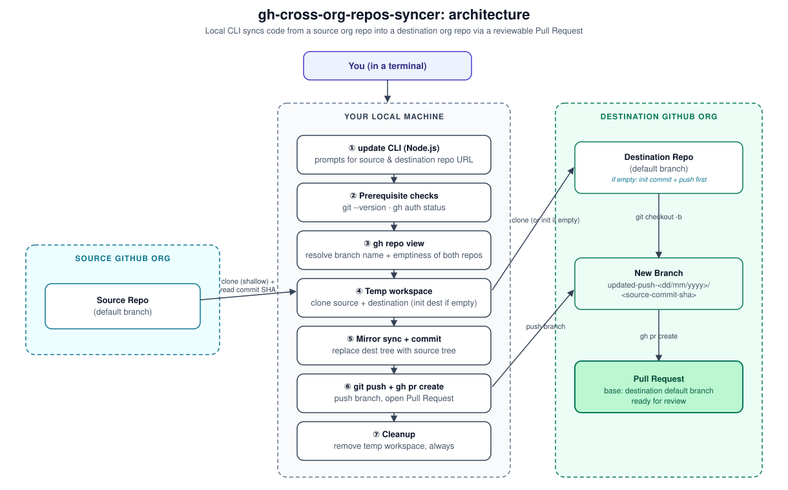

# Architecture

`gh-cross-org-repos-syncer` has no server, no CI, and no persistent state. It is a single Node.js process that shells out to `git` and `gh` on your machine, using your own authenticated GitHub CLI session.

## Flow

1. **CLI prompts.** `update` asks for a source repository URL and a destination repository URL (e.g. `https://github.com/<org>/<repo>`, a bare `org/repo` also works). For the destination, the repo part is optional and defaults to the source repo name if left out.
2. **Prerequisite checks.** The tool verifies `git` and `gh` are installed and that `gh auth status` succeeds before touching any repository.
3. **Resolve repo info.** `gh repo view` looks up the default branch and emptiness of both repositories. A repo with zero commits has no `defaultBranchRef` via GraphQL, so its configured branch name is read from the REST API instead, which reports it even when the repo is empty. If the source repo is empty, the sync fails immediately (there is nothing to copy).
4. **Temporary workspace.** A temp directory is created (`os.tmpdir()`), and both repositories are shallow-cloned into it. If the destination repository is empty, it's cloned plainly, its default branch is created locally, an empty commit is pushed to establish it on the remote, and only then does the sync continue, so there is a base for the Pull Request.
5. **Mirror sync.** The destination working tree (excluding `.git`) is cleared and replaced with the source working tree. This is a full mirror, not a merge.
6. **Branch, commit, push.** A branch named `updated-push-<dd/mm/yyyy>/<source-commit-sha>` is created off the destination repo. The commit message is `chore: updated code pushing from the <source-org> <source-repo>`. The branch is pushed to the destination repository.
7. **Pull Request.** `gh pr create` opens a PR in the destination repository targeting its default branch, so a human reviews the diff before it merges.
8. **Cleanup.** The temporary workspace is removed whether the run succeeds or fails.

## Why the branch name includes the commit SHA

Using the sync date alone (`updated-push-<dd/mm/yyyy>`) meant two syncs on the same day would try to reuse the same branch name and collide. Appending the source repo's short commit SHA (read right after cloning it) keeps branch names unique per source state, while still being human-readable and sorted by day.

## Handling an empty destination repository

A Pull Request needs an existing base branch to target, but a brand-new destination repository has no commits and therefore no branches at all. Rather than fail or push the source content directly into that branch (which would skip review), the tool creates the destination's configured default branch locally and pushes a single empty commit to establish it. The actual synced content still lands on its own `updated-push-<date>/<sha>` branch and goes through the normal Pull Request. The source repository is never bootstrapped this way: if it's empty, there's nothing to sync, so the tool fails immediately instead.

## No hidden state

Nothing is written outside the temp workspace, and the temp workspace never survives the run. Every invocation of `update` is independent: same org, different org, same repo, different repo, it doesn't matter, because none of it is hardcoded or cached between runs.
